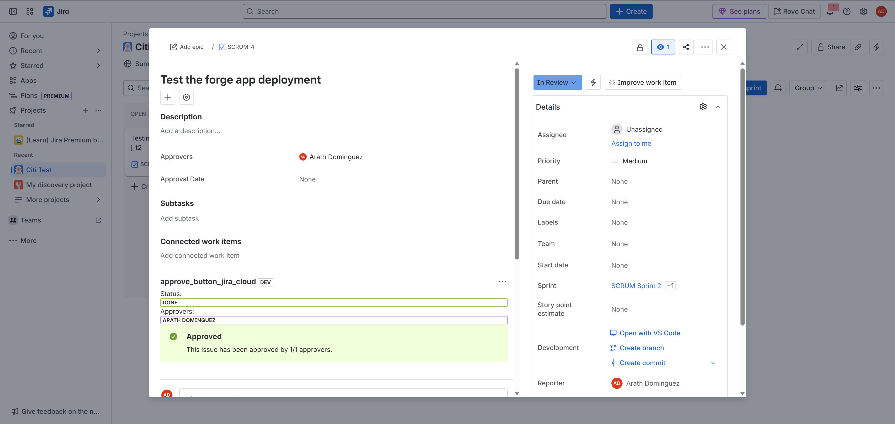
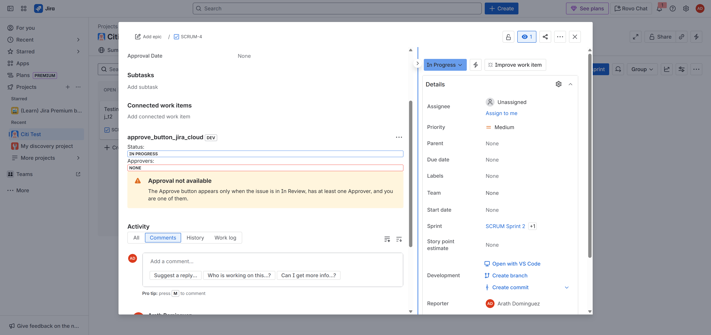
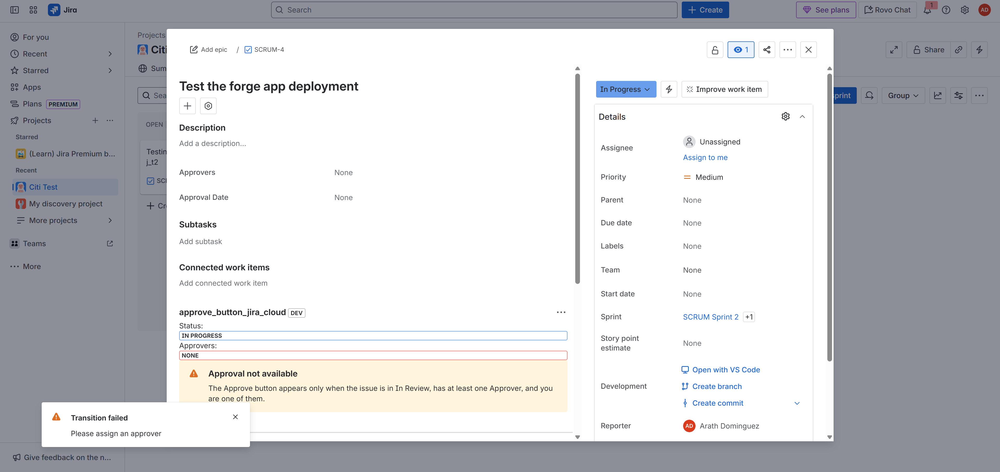
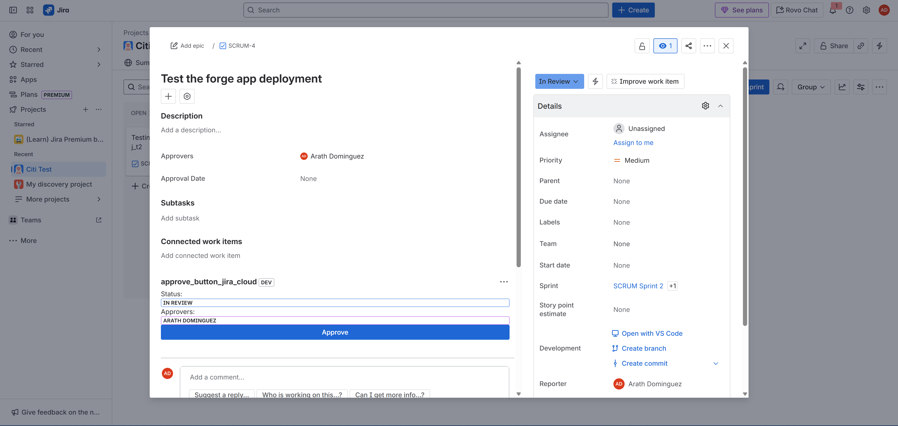

# Jira Cloud Approval Panel (Forge App)

This project is a Forge app for Jira Cloud that provides an **approval panel** inside the issue view.  
It introduces an **Approve** button, conditional visibility logic, and approval tracking (x/y approvers).  

---

## 📌 Features of approve_button_jira_cloud

- **Inline Lozenge Display**
  - Shows current **status** with a lozenge (green when Done, blue when In Review, etc.)
  - Shows all **approvers** as lozenges on a single line.

- **Conditional Approve Button**
  - Appears only when:
    - The issue is in **In Review** status.
    - The **Approvers** field is populated.
    - The **current user** is one of the approvers.

- **Approval Workflow Transition**
  - On click, performs a Jira workflow transition from (`In Review`) -> (`Approved`) and updates the **Approval Date** Jira field on refresh.

- **Approval Tracking (x/y)**
  - Uses an **issue property** (`approvalVotes`) to track which approvers have clicked approve.
  - Displays progress as **x/y approvers**.
  - Limitations: Have to add another logic check to ensure the transition to Approved is only possible when 100% of approvers have approved.

- **Auto-Refresh**
  - Listens to `JIRA_ISSUE_CHANGED` events so the panel refreshes when the issue updates.
  - Limitation: Only refreshes the Jira issue panel. Have not found the functionality to refresh the right hand side that shows the transition. 
    

---

## ⚙️ Technical Overview

- **Forge Modules**
  - `jira:issuePanel` → Adds the panel to issue view.
- **Frontend**
  - Built with **React** and `@forge/react` UI Kit 2.
  - Utilized UI Kit to work with easy to use components that run natively
- **APIs**
  - `requestJira` for Jira REST API calls (fetching issue data, performing transitions, updating fields).
  - `events.on('JIRA_ISSUE_CHANGED')` to refresh UI on issue updates.
- **Custom Fields**
  - Approvers field: `customfield_10003`
  - Approval Date field: `customfield_10067`
  - Obtained field numbers with API Call
  <pre> https://smu-arath.atlassian.net/rest/api/2/issue/createmeta?expand=projects.issuetypes.fields&projectKeys=SCRUM </pre>

---

## 🖥️ User Experience

### Issue View with In Progress Status

### Workflow Validation Test
Not able to properly transition from `In Progress` to `In Review` because there is an assigned workflow validation check that ensures that at least one approver is assigned

### Successfully Transition to In Review

### Successfully Approved
.png)

---

## 🚀 How It Works (Step-by-Step)

1. **Panel Loads**
   - Fetches current user, status, approvers, and prior approval votes.
2. **Conditional Logic**
   - Determines if Approve button should show.
3. **On Approve Click**
   - Workflow transition → “Approved”
   - Updates Approval Date field
   - Writes approver ID into issue property
   - Refreshes panel UI
4. **Display**
   - Status and Approvers inline as lozenges
   - Success message with **x/y approvals**

## ✅ Next Steps

- Map status names to consistent lozenge colors (e.g., In Progress = blue, In Review = yellow).  
- Transition to approved only when 100% of approvers have approved.
- (Jira limitation) You can’t programmatically refresh the whole issue view
- Optionally show *who* approved (names with lozenges) instead of only counts.  
- Add Jira automation rule to notify admins when all approvers have approved.  (not necessary to use forge here)
